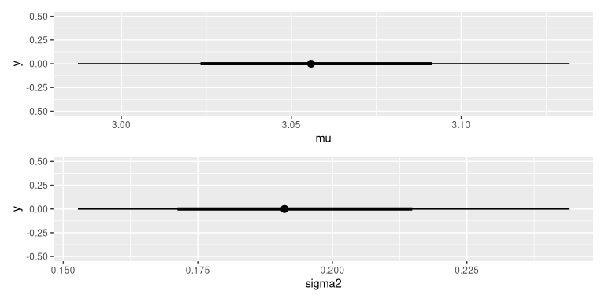

<!-- README.md is generated from README.Rmd. Please edit that file -->
# iNZightBayes

<!-- badges: start -->
[](https://github.com/iNZightVIT/iNZightBayes/actions) [](https://codecov.io/gh/iNZightVIT/iNZightBayes?branch=master) <!-- badges: end -->

The goal of iNZightBayes is to ...

## Installation

You can install the released version of iNZightBayes from [CRAN](https://CRAN.R-project.org) with:

``` r
# install.packages("iNZightBayes")
```

And the development version from [GitHub](https://github.com/) with:

``` r
# install.packages("devtools")
devtools::install_github("iNZightVIT/iNZightBayes")
```

## Example

``` r
library(iNZightBayes)

post <- estimate_mean(~Sepal.Width, data = iris)
summary(post)
#> 
#> Iterations = 1001:2000
#> Thinning interval = 1 
#> Number of chains = 1 
#> Sample size per chain = 1000 
#> 
#> 1. Empirical mean and standard deviation for each variable,
#>    plus standard error of the mean:
#> 
#>          Mean      SD Naive SE Time-series SE
#> mu     3.0579 0.03605 0.001140       0.001140
#> sigma2 0.1934 0.02299 0.000727       0.000727
#> 
#> 2. Quantiles for each variable:
#> 
#>         2.5%    25%    50%    75%  97.5%
#> mu     2.988 3.0329 3.0583 3.0825 3.1253
#> sigma2 0.153 0.1773 0.1909 0.2074 0.2427
plot(post)
```


