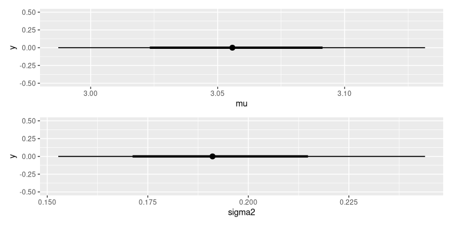
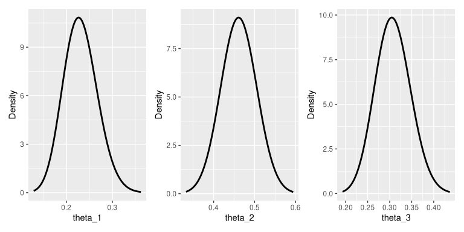
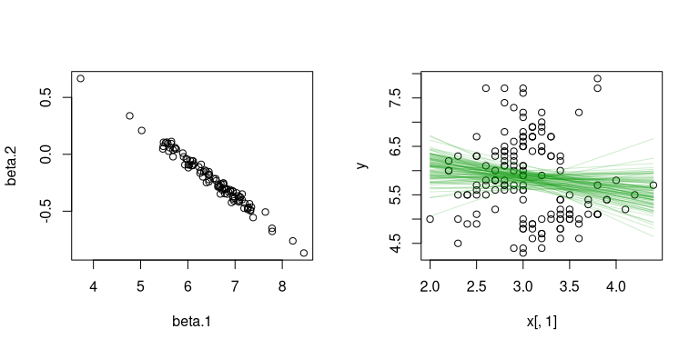

<!-- README.md is generated from README.Rmd. Please edit that file -->

# iNZightBayes

<!-- badges: start -->

[](https://github.com/iNZightVIT/iNZightBayes/actions)
[](https://codecov.io/gh/iNZightVIT/iNZightBayes?branch=master)

<!-- badges: end -->

The goal of iNZightBayes is to …

## Installation

You can install the released version of iNZightBayes from
[CRAN](https://CRAN.R-project.org) with:

``` r
# install.packages("iNZightBayes")
```

And the development version from [GitHub](https://github.com/) with:

``` r
# install.packages("devtools")
devtools::install_github("iNZightVIT/iNZightBayes")
```

## Example

``` r
library(iNZightBayes)

post <- estimate_mean(~Sepal.Width, data = iris)
summary(post)
#> 
#> Iterations = 1001:2000
#> Thinning interval = 1 
#> Number of chains = 1 
#> Sample size per chain = 1000 
#> 
#> 1. Empirical mean and standard deviation for each variable,
#>    plus standard error of the mean:
#> 
#>          Mean      SD  Naive SE Time-series SE
#> mu     3.0564 0.03643 0.0011520      0.0011566
#> sigma2 0.1922 0.02177 0.0006885      0.0007266
#> 
#> 2. Quantiles for each variable:
#> 
#>         2.5%    25%    50%   75%  97.5%
#> mu     2.984 3.0315 3.0573 3.082 3.1255
#> sigma2 0.154 0.1771 0.1909 0.205 0.2382
plot(post)
#> Warning: `aes_string()` was deprecated in ggplot2 3.0.0.
#> ℹ Please use tidy evaluation idioms with `aes()`.
#> ℹ See also `vignette("ggplot2-in-packages")` for more information.
#> ℹ The deprecated feature was likely used in the iNZightBayes package.
#>   Please report the issue to the authors.
#> This warning is displayed once per session.
#> Call `lifecycle::last_lifecycle_warnings()` to see where this warning was generated.
```



In some cases, the posterior can be calculated exactly.

``` r
post <- estimate_proportions(c(20, 50, 30), alpha = c(10, 10, 10))
summary(post)
#>          mean       var  2.5% 97.5%
#> theta_1 0.231 -4.52e-05 0.164 0.306
#> theta_2 0.462 -3.16e-05 0.375 0.546
#> theta_3 0.308 -4.07e-05 0.231 0.390
plot(post)
#> Warning: Using `size` aesthetic for lines was deprecated in ggplot2 3.4.0.
#> ℹ Please use `linewidth` instead.
#> ℹ The deprecated feature was likely used in the iNZightBayes package.
#>   Please report the issue to the authors.
#> This warning is displayed once per session.
#> Call `lifecycle::last_lifecycle_warnings()` to see where this warning was generated.
```



There’s also linear regression:

``` r
# temporary syntax:
y <- iris$Sepal.Length
x <- cbind(iris$Sepal.Width)
post <- gibbs_lm(y, x, 100)

par(mfrow = c(1, 2))
plot(post$posterior[,1:2])
plot(x[,1], y)
apply(post$posterior[,1:2], 1,
  function(b)
    lines(x[,1], cbind(1, x) %*% b, col = "#00990030"))
```



    #> NULL
