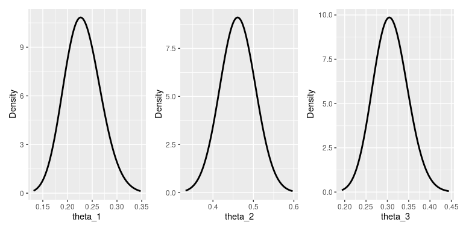

<!-- README.md is generated from README.Rmd. Please edit that file -->

# iNZightBayes

<!-- badges: start -->

[](https://github.com/iNZightVIT/iNZightBayes/actions)
[](https://codecov.io/gh/iNZightVIT/iNZightBayes?branch=master)
<!-- badges: end -->

The goal of iNZightBayes is to …

## Installation

You can install the released version of iNZightBayes from
[CRAN](https://CRAN.R-project.org) with:

``` r
# install.packages("iNZightBayes")
```

And the development version from [GitHub](https://github.com/) with:

``` r
# install.packages("devtools")
devtools::install_github("iNZightVIT/iNZightBayes")
```

## Example

``` r
library(iNZightBayes)

post <- estimate_mean(~Sepal.Width, data = iris)
summary(post)
#> 
#> Iterations = 1001:2000
#> Thinning interval = 1 
#> Number of chains = 1 
#> Sample size per chain = 1000 
#> 
#> 1. Empirical mean and standard deviation for each variable,
#>    plus standard error of the mean:
#> 
#>          Mean      SD  Naive SE Time-series SE
#> mu     3.0583 0.03485 0.0011022      0.0010898
#> sigma2 0.1919 0.02208 0.0006983      0.0006983
#> 
#> 2. Quantiles for each variable:
#> 
#>          2.5%    25%    50%    75%  97.5%
#> mu     2.9928 3.0341 3.0580 3.0817 3.1275
#> sigma2 0.1558 0.1766 0.1897 0.2053 0.2433
plot(post)
```


In some cases, the posterior can be calculated exactly.

``` r
post <- estimate_proportions(c(20, 50, 30), alpha = c(10, 10, 10))
summary(post)
#>          mean       var  2.5% 97.5%
#> theta_1 0.231 -4.52e-05 0.163 0.307
#> theta_2 0.462 -3.16e-05 0.378 0.547
#> theta_3 0.308 -4.07e-05 0.233 0.388
plot(post)
```



There’s also linear regression:

``` r
# temporary syntax:
y <- iris$Sepal.Length
x <- cbind(iris$Sepal.Width)
post <- gibbs_lm(y, x, 100)

par(mfrow = c(1, 2))
plot(post$posterior$beta)
plot(x[,1], y)
apply(post$posterior$beta, 1,
  function(b)
    lines(x[,1], cbind(1, x) %*% b, col = "#00990030"))
```


    #> NULL
