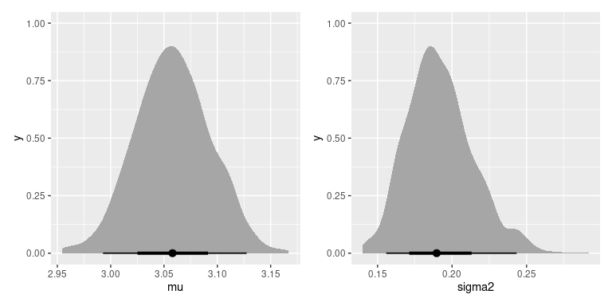

<!-- README.md is generated from README.Rmd. Please edit that file -->

# iNZightBayes

<!-- badges: start -->

[](https://github.com/iNZightVIT/iNZightBayes/actions)
[](https://codecov.io/gh/iNZightVIT/iNZightBayes?branch=master)
<!-- badges: end -->

The goal of iNZightBayes is to …

## Installation

You can install the released version of iNZightBayes from
[CRAN](https://CRAN.R-project.org) with:

``` r
# install.packages("iNZightBayes")
```

And the development version from [GitHub](https://github.com/) with:

``` r
# install.packages("devtools")
devtools::install_github("iNZightVIT/iNZightBayes")
```

## Example

``` r
library(iNZightBayes)

post <- estimate_mean(~Sepal.Width, data = iris)
summary(post)
#> 
#> Iterations = 1001:2000
#> Thinning interval = 1 
#> Number of chains = 1 
#> Sample size per chain = 1000 
#> 
#> 1. Empirical mean and standard deviation for each variable,
#>    plus standard error of the mean:
#> 
#>          Mean      SD  Naive SE Time-series SE
#> mu     3.0576 0.03664 0.0011587      0.0012404
#> sigma2 0.1923 0.02203 0.0006968      0.0006968
#> 
#> 2. Quantiles for each variable:
#> 
#>          2.5%    25%    50%    75% 97.5%
#> mu     2.9857 3.0340 3.0581 3.0833 3.128
#> sigma2 0.1548 0.1769 0.1905 0.2057 0.242
plot(post)
```



In some cases, the posterior can be calculated exactly.

``` r
post <- estimate_proportions(c(20, 50, 30), alpha = c(10, 10, 10))
summary(post)
#>          mean       var  2.5% 97.5%
#> theta_1 0.231 -4.52e-05 0.163 0.306
#> theta_2 0.462 -3.16e-05 0.379 0.548
#> theta_3 0.308 -4.07e-05 0.234 0.389
plot(post)
```


