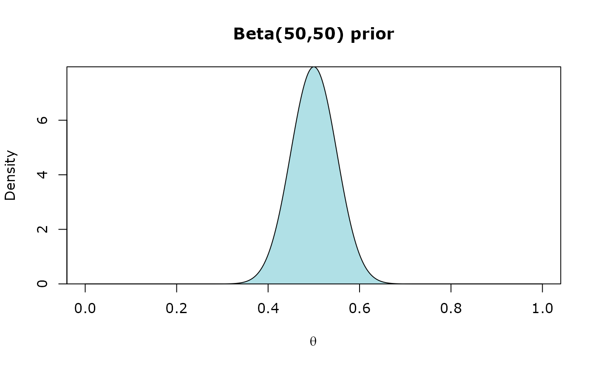
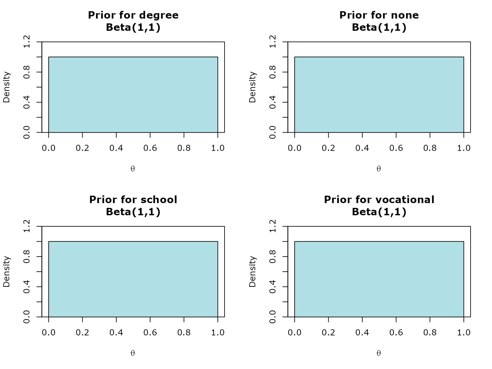
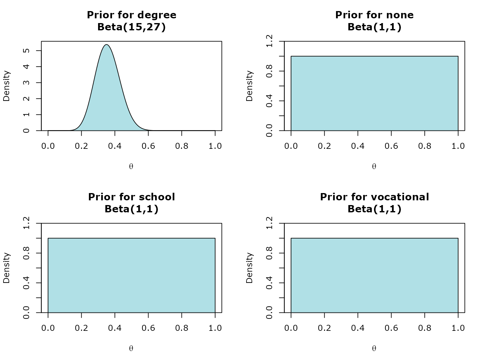

# Conjugate Priors

Likelihood functions: inz_lbinom, inz_lmulti, inz_lnorm

Prior functions: inz_dbeta, inz_ddir, inz_dNIG

Posterior calculation: calculate_posterior

Output: summary

To demonstrate how the functions work together, we will use the
**SURFIncomeSurvey_200** example dataset from iNZight.

``` r
library(iNZightBayes)
surf_data <- read.csv("surf.csv")
head(surf_data)
```

    ##   Personid Gender Qualification Age Hours Income Marital Ethnicity
    ## 1        1 female        school  15     4     87   never  European
    ## 2        2 female    vocational  40    42    596 married  European
    ## 3        3   male          none  38    40    497 married     Maori
    ## 4        4 female    vocational  34     8    299   never  European
    ## 5        5 female        school  45    16    301 married  European
    ## 6        6   male        degree  45    50   1614 married  European

  

## Beta-Binomial

This is the parameter estimation method for when the primary variable of
interest is a two-level categorical variable. Supports single variable
and two-variable (categorical/categorical) cases.

With this application we will use the ‘inz_lbinom’ and ‘inz_dbeta’
functions to construct our prior and likelihood object.

### Univariate application

#### Gender variable

``` r
head(surf_data$Gender, n=10)
```

    ##  [1] "female" "female" "male"   "female" "female" "male"   "female" "male"  
    ##  [9] "female" "male"

First, we construct our **likelihood** object from the data. This is the
likelihood component of the Bayes’ Theorem, $`p(x | \theta)`$.

``` r
likelihood <- inz_lbinom(surf_data, Gender)
```

*With this variable, we would like to estimate the proportion of females
(‘successes’) in the population, $`\theta`$. Hence, we will also be
inherently estimating the proportion of males (‘failures’),
1-$`\theta`$, as well.*

Next, we set up **the prior**, by passing the likelihood object into the
prior function. This is the prior component of the Bayes’ Theorem
$`p(\theta)`$. To start off, we will use an uninformative prior,
Beta(1,1). This is the default prior set in the ‘inz_dbeta’ function.

``` r
prior <- inz_dbeta(likelihood)
```


*Beta(1,1) = Uniform(0,1). With this prior, we are essentially implying
that we don’t have prior knowledge of $`\theta`$ (the proportion of
females) in the population. Hence, all possible values of $`\theta`$ are
assigned equal probability.*

Finally, we pass the prior object which contains the likelihood and
prior information into the calculate_posterior function. This function
calculates the **posterior** parameters. This is the posterior component
of the Bayes’ Theorem, $`p(\theta | x)`$.

``` r
posterior <- calculate_posterior(prior)
```

This posterior object is used to obtain posterior estimates and credible
interval values through summary function.

``` r
summary(posterior)
```

    ## Estimated Proportions with 95% Credible Interval using a Beta(1,1) prior
    ## 
    ##        Estimate  Lower  Upper
    ## female   0.5347 0.4658 0.6029
    ## male     0.4653 0.3971 0.5342

As we used an uninformative prior, the estimate of $`\theta`$ (and
1-$`\theta`$) is very similar to the proportions seen in the data
itself, which is 0.5350 (107/200) for females and 0.4650 (93/200) for
males.

#### Changing the prior…

We have prior knowledge/belief that $`\theta`$, the proportion of
females in the population is around 0.5 (50%).

Let’s change the prior to an informative prior of **Beta(50,50)**:

``` r
prior <- inz_dbeta(likelihood, alpha = 50, beta = 50)
```



Compared to the uninformative prior we used before, this prior assigns
the highest probability to $`\theta`$ = 0.5. The probability gradually
decreases for higher and lower values of $`\theta`$ (from 0.5).

``` r
posterior <- calculate_posterior(prior)
summary(posterior)
```

    ## Estimated Proportions with 95% Credible Interval using a Beta(50,50) prior
    ## 
    ##        Estimate  Lower  Upper
    ## female   0.5233 0.4668 0.5796
    ## male     0.4767 0.4204 0.5332

We can observe that the estimate of the proportion of females in the
population, $`\theta`$, has decreased to 0.5233 (52.33%) from 0.5347
(53.47%) using the informative prior.

  

### Output settings

**We can set the credible level of the credible interval outputs. This
is done using the `cred_level` argument.**

The default credible level is 95%.

If we want a 90% credible interval for our estimates, `cred_level=90`:

``` r
posterior <- calculate_posterior(prior, cred_level=90)
summary(posterior)
```

    ## Estimated Proportions with 90% Credible Interval using a Beta(50,50) prior
    ## 
    ##        Estimate  Lower  Upper
    ## female   0.5233 0.4759 0.5706
    ## male     0.4767 0.4294 0.5241

  

**We can also round the output values (in significant figures). This is
done using the `signif_value` argument.**

The output below are rounded to 2 significant figures:

``` r
posterior <- calculate_posterior(prior, signif_value=2)
summary(posterior)
```

    ## Estimated Proportions with 95% Credible Interval using a Beta(50,50) prior
    ## 
    ##        Estimate Lower Upper
    ## female     0.52  0.47  0.58
    ## male       0.48  0.42  0.53

  

### Bivariate application

#### Gender vs Qualification

**The data:**

``` r
likelihood <- inz_lbinom(surf_data, Gender, Qualification)
```

With the two variables, we would like to estimate the proportion of
females (‘successes’) (and hence, the proportion of males (‘failures’))
conditional on the groups in the secondary variable (Qualification).

In other words, we want to estimate the proportion of Gender for each
group/level in Qualification.

**The prior:**

We will use **Beta(1,1) prior** (Uniform prior) for all groups:

``` r
prior <- inz_dbeta(likelihood)
```



**The posterior:**

``` r
posterior <- calculate_posterior(prior)
summary(posterior)
```

    ## Prior
    ##                     
    ## degree     Beta(1,1)
    ## none       Beta(1,1)
    ## school     Beta(1,1)
    ## vocational Beta(1,1)
    ## 
    ## 
    ## Estimated Proportions
    ## 
    ##            female   male
    ## degree     0.4000 0.6000
    ## none       0.5610 0.4390
    ## school     0.5882 0.4118
    ## vocational 0.5217 0.4783
    ## 
    ## 
    ## 95% Credible Intervals
    ## 
    ##            female   male
    ## degree     0.2352 0.4226
    ##            0.5774 0.7648
    ## none       0.4089 0.2926
    ##            0.7074 0.5911
    ## school     0.4700 0.2985
    ##            0.7015 0.5300
    ## vocational 0.4045 0.3622
    ##            0.6378 0.5955

#### Changing the prior…

Let’s change the prior for degree group.

We have a prior belief that the proportion of females whose highest
qualification is a degree is lower than males and is somewhere around
0.35.

``` r
prior <- inz_dbeta(likelihood, alpha = c(15,1,1,1), beta = c(27,1,1,1))
```



``` r
posterior <- calculate_posterior(prior)
summary(posterior)
```

    ## Prior
    ##                       
    ## degree     Beta(15,27)
    ## none       Beta(1,1)  
    ## school     Beta(1,1)  
    ## vocational Beta(1,1)  
    ## 
    ## 
    ## Estimated Proportions
    ## 
    ##            female   male
    ## degree     0.3714 0.6286
    ## none       0.5610 0.4390
    ## school     0.5882 0.4118
    ## vocational 0.5217 0.4783
    ## 
    ## 
    ## 95% Credible Intervals
    ## 
    ##            female   male
    ## degree     0.2629 0.5131
    ##            0.4869 0.7371
    ## none       0.4089 0.2926
    ##            0.7074 0.5911
    ## school     0.4700 0.2985
    ##            0.7015 0.5300
    ## vocational 0.4045 0.3622
    ##            0.6378 0.5955

  

## Dirichlet-Multinomial

This is the parameter estimation method for when the primary variable of
interest is a multi-level categorical variable. Supports single variable
and two-variable (categorical/categorical) cases.

With this application we will use the ‘inz_lmulti’ and ‘inz_ddir’
functions to construct our prior and likelihood object.

### Univariate application

#### Qualification variable

``` r
head(surf_data$Qualification, n=10)
```

    ##  [1] "school"     "vocational" "none"       "vocational" "school"    
    ##  [6] "degree"     "none"       "degree"     "vocational" "school"

``` r
likelihood <- inz_lmulti(surf_data, Qualification)
prior <- inz_ddir(likelihood)
```

Using a **Dirichlet(1,1,1,1) prior** (Uniform)

The posterior:

``` r
posterior <- calculate_posterior(prior)
summary(posterior)
```

    ## Estimated Proportions with 95% Credible Interval using a Dirichlet(1,1,1,1) prior
    ## 
    ##            Estimate   Lower  Upper
    ## degree       0.1422 0.09781 0.1931
    ## none         0.1961 0.14470 0.2531
    ## school       0.3284 0.26580 0.3942
    ## vocational   0.3333 0.27040 0.3993

  

#### Using a differnt prior

The likelihood (data) remains the same

Let’s use the Jeffreys prior - **Dirichlet(0.5,0.5,0.5,0.5)**:

``` r
prior <- inz_ddir(likelihood, alpha = rep(0.5, 4))
posterior <- calculate_posterior(prior)
summary(posterior)
```

    ## Estimated Proportions with 95% Credible Interval using a Dirichlet(0.5,0.5,0.5,0.5) prior
    ## 
    ##            Estimate  Lower  Upper
    ## degree       0.1411 0.0967 0.1922
    ## none         0.1955 0.1440 0.2528
    ## school       0.3292 0.2662 0.3954
    ## vocational   0.3342 0.2709 0.4005

  

### Bivariate application

#### Qualification vs Gender

``` r
table(surf_data$Qualification, surf_data$Gender)
```

    ##             
    ##              female male
    ##   degree         11   17
    ##   none           22   17
    ##   school         39   27
    ##   vocational     35   32

``` r
likelihood <- inz_lmulti(surf_data, Qualification, Gender)
prior <- inz_ddir(likelihood)
posterior <- calculate_posterior(prior)
summary(posterior)
```

    ## Prior
    ##                           
    ## female Dirichlet (1,1,1,1)
    ## male   Dirichlet (1,1,1,1)
    ## 
    ## 
    ## Estimated Proportions
    ## 
    ##        degree   none school vocational
    ## female 0.1081 0.2072 0.3604     0.3243
    ## male   0.1856 0.1856 0.2887     0.3402
    ## 
    ## 
    ## 95% Credible Intervals
    ## 
    ##         degree   none school vocational
    ## female 0.05765 0.1374 0.2740     0.2408
    ##        0.17190 0.2870 0.4515     0.4138
    ## male   0.11510 0.1151 0.2033     0.2498
    ##        0.26830 0.2683 0.3822     0.4369

#### Qualification vs Ethnicity

``` r
likelihood <- inz_lmulti(surf_data, Qualification, Ethnicity)
prior <- inz_ddir(likelihood)
posterior <- calculate_posterior(prior)
summary(posterior)
```

    ## Prior
    ##                             
    ## European Dirichlet (1,1,1,1)
    ## Maori    Dirichlet (1,1,1,1)
    ## other    Dirichlet (1,1,1,1)
    ## Pacific  Dirichlet (1,1,1,1)
    ## 
    ## 
    ## Estimated Proportions
    ## 
    ##           degree    none  school vocational
    ## European 0.15620 0.19380 0.31880    0.33120
    ## Maori    0.10710 0.25000 0.39290    0.25000
    ## other    0.17650 0.11760 0.17650    0.52940
    ## Pacific  0.09091 0.27270 0.45450    0.18180
    ## 
    ## 
    ## 95% Credible Intervals
    ## 
    ##            degree    none  school vocational
    ## European 0.104400 0.13650 0.24900    0.26070
    ##          0.216200 0.25830 0.39280    0.40580
    ## Maori    0.023530 0.11110 0.22390    0.11110
    ##          0.242900 0.42260 0.57630    0.42260
    ## other    0.040470 0.01551 0.04047    0.29880
    ##          0.383500 0.30230 0.38350    0.75350
    ## Pacific  0.002529 0.06674 0.18710    0.02521
    ##          0.308500 0.55610 0.73760    0.44500

**Changing prior**

``` r
prior <- inz_ddir(likelihood,
  alpha = matrix(rep(0.5,16),
  ncol=length(likelihood$levels))
)
posterior <- calculate_posterior(prior)
summary(posterior)
```

    ## Prior
    ##                                     
    ## European Dirichlet (0.5,0.5,0.5,0.5)
    ## Maori    Dirichlet (0.5,0.5,0.5,0.5)
    ## other    Dirichlet (0.5,0.5,0.5,0.5)
    ## Pacific  Dirichlet (0.5,0.5,0.5,0.5)
    ## 
    ## 
    ## Estimated Proportions
    ## 
    ##           degree    none  school vocational
    ## European 0.15510 0.19300 0.31960    0.33230
    ## Maori    0.09615 0.25000 0.40380    0.25000
    ## other    0.16670 0.10000 0.16670    0.56670
    ## Pacific  0.05556 0.27780 0.50000    0.16670
    ## 
    ## 
    ## 95% Credible Intervals
    ## 
    ##             degree     none  school vocational
    ## European 1.031e-01 0.135500 0.24940    0.26120
    ##          2.153e-01 0.257900 0.39410    0.40740
    ## Maori    1.700e-02 0.106900 0.22750    0.10690
    ##          2.327e-01 0.429400 0.59420    0.42940
    ## other    3.092e-02 0.007819 0.03092    0.31940
    ##          3.849e-01 0.288400 0.38490    0.79710
    ## Pacific  5.949e-05 0.055970 0.19900    0.01384
    ##          2.622e-01 0.591600 0.80100    0.45370
