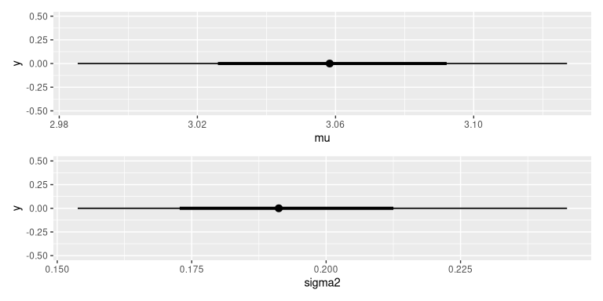
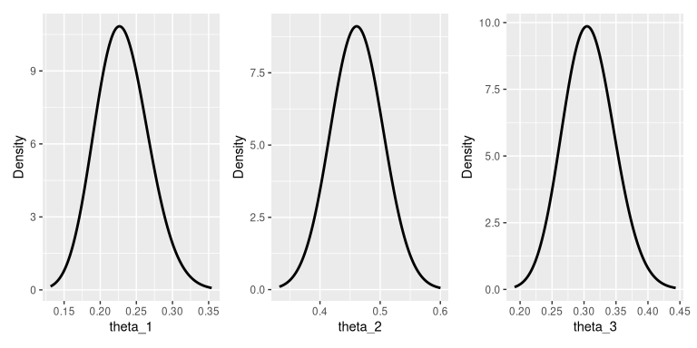
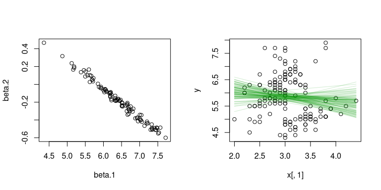

# iNZightBayes

The goal of iNZightBayes is to lower the barrier to entry for Bayesian
analysis by providing a simple interface for Bayesian estimation and
inference. When combined with iNZight (a GUI) students and anyone else
just getting started with Bayesian analysis can quickly start exploring
priors and posteriors to develop an understanding, before learning the
technical and coding details.

## Installation

You can install the released version of iNZightBayes from
[CRAN](https://CRAN.R-project.org) with:

``` r
# install.packages("iNZightBayes")
```

And the development version from [GitHub](https://github.com/) with:

``` r
# install.packages("devtools")
devtools::install_github("iNZightVIT/iNZightBayes")
```

## Example

``` r
library(iNZightBayes)

post <- estimate_mean(~Sepal.Width, data = iris)
summary(post)
#> 
#> Iterations = 1001:2000
#> Thinning interval = 1 
#> Number of chains = 1 
#> Sample size per chain = 1000 
#> 
#> 1. Empirical mean and standard deviation for each variable,
#>    plus standard error of the mean:
#> 
#>          Mean      SD Naive SE Time-series SE
#> mu     3.0585 0.03608 0.001141       0.001141
#> sigma2 0.1929 0.02220 0.000702       0.000702
#> 
#> 2. Quantiles for each variable:
#> 
#>          2.5%    25%    50%    75%  97.5%
#> mu     2.9854 3.0358 3.0583 3.0819 3.1270
#> sigma2 0.1538 0.1774 0.1912 0.2065 0.2448
plot(post)
#> Warning: `aes_string()` was deprecated in ggplot2 3.0.0.
#> ℹ Please use tidy evaluation idioms with `aes()`.
#> ℹ See also `vignette("ggplot2-in-packages")` for more information.
#> ℹ The deprecated feature was likely used in the iNZightBayes package.
#>   Please report the issue at <https://github.com/iNZightVIT/iNZightBayes/issues>.
#> This warning is displayed once per session.
#> Call `lifecycle::last_lifecycle_warnings()` to see where this warning was generated.
```



In some cases, the posterior can be calculated exactly.

``` r
post <- estimate_proportions(c(20, 50, 30), alpha = c(10, 10, 10))
summary(post)
#>          mean       var  2.5% 97.5%
#> theta_1 0.231 -4.52e-05 0.164 0.306
#> theta_2 0.462 -3.16e-05 0.376 0.550
#> theta_3 0.308 -4.07e-05 0.230 0.391
plot(post)
#> Warning: Using `size` aesthetic for lines was deprecated in ggplot2 3.4.0.
#> ℹ Please use `linewidth` instead.
#> ℹ The deprecated feature was likely used in the iNZightBayes package.
#>   Please report the issue at <https://github.com/iNZightVIT/iNZightBayes/issues>.
#> This warning is displayed once per session.
#> Call `lifecycle::last_lifecycle_warnings()` to see where this warning was generated.
```



There’s also linear regression:

``` r
# temporary syntax:
y <- iris$Sepal.Length
x <- cbind(iris$Sepal.Width)
post <- gibbs_lm(y, x, 100)

par(mfrow = c(1, 2))
plot(post$posterior[,1:2])
plot(x[,1], y)
apply(post$posterior[,1:2], 1,
  function(b)
    lines(x[,1], cbind(1, x) %*% b, col = "#00990030"))
```



``` R
#> NULL
```
